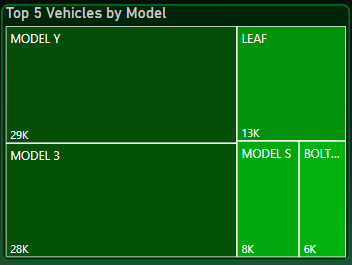

# Electric-Vehicle-Analysis

## Introduction:
Utilized advanced data analysis tools such as Excel, Power Query, and Power BI to conduct an in-depth examination of alternative power vehicles within the automotive sector. This involved constructing a comprehensive Power BI dashboard to visualize intricate details such as manufacturer data, model years, vehicle types, and electric range. Implemented Data Modeling techniques to enhance precision and accuracy, resulting in valuable insights for informed decision-making in the industry.

## About the Dataset:
This dataset shows the Battery Electric Vehicles (BEVs) and Plug-in Hybrid Electric Vehicles (PHEVs) that are currently registered through Washington State Department of Licensing (DOL). BEV sales during Q2 2023 grew over 50% YoY. One in every 10 cars sold during Q2 2023 was a pure battery electric vehicle (BEV). China remained the leader in global BEV sales followed by USA and Germany. BEV sales in the USA grew by almost 57% YoY, the highest among the top 3 EV markets

*Brief Information About the Features of Dataset:*

- **VIN:** A Vehicle Identification Number (VIN) is the identifying code for a specific automobile.
- **Country:**. Country where it is Manufactured.
- **City:** location of Company that manufactures Electric Cars.
- **Postal Code:** Pin code is the post office numbering code system used by the postal service.
- **Model Year:** a year in which the car was manufactured.
- **Make** Name of Company.
- **Model:** A vehicle identification number (VIN) is a unique, 17-digit code specific to every vehicle.
- **Electric Vehicle Type:** When talking about EVs, we generally refer to three main types of electric vehicles: hybrid electric vehicles (HEV), plug-in hybrid electric vehicles (PHEV), and battery electric vehicles (BEV).
- **Clean Alternative Fuel Vehicle:** Vegetable oils, such as palm, soybean, sunflower, peanut, and olive, as alternative fuels can be used for diesel engines. As an alternative fuel, vegetable oil is one of the renewable fuels.
- **Electric Range:** All-electric vehicles can typically go between 110 and over 300 miles on a single charge. PHEVs can typically go 15–60 miles on battery power alone; the fuel tank capacity determines their overall range because the engine kicks in when the battery is depleted.
- **Base MSRP:** Manufacturers set a base price for a car or vehicle without add-on products or features. The Manufacturer's Suggested Retail Price (MSRP) is the base price plus additional features.
- **Legislative District:** While the Legislature of every State shall consist of the Governor and the State Legislature, in some of the States, the Legislature shall consist of two Houses, namely, the Legislative Assembly and the Legislative Council, while in the rest, there shall be only one House, namely the legislative assembly.
- **DOL Vehicle ID:** DOL Vehicle ID. A unique identification number for each vehicle is present in the Transactions dataset. Transactions done on the same vehicle will have the same DOL Vehicle ID.
- **Vehicle Location:** In cases where the vehicle was designed for electric motors, they are generally located at the front and/or rear between the wheels. There are short half-shafts connecting the output of the motors to the wheels.
- **Electric Utility:** A corporation, person, agency, authority, or other legal entity or instrumentality aligned with distribution facilities for delivery of electric energy for use primarily by the public.
- **2020 Census Tract:** Census tracts are relatively permanent small-area geographic divisions of a county or statistically equivalent entity defined for the tabulation and presentation of data from the decennial census and selected other statistical programs

(Link to the dataset:)[https://www.kaggle.com/datasets/yashusinghal/electric-vehicle-population-dataset]

## Problem Statements:
This analysis requires two areas. These are: KPIs and Charts requirements.

### KPIs Requirement:
   I.  **Total Vehicles:**
       Understand the overall landscape of electric vehicles, encompassing both BEVs and PHEVs, to assess the market's size and growth.

  II.  **Average Electric Range:**
       Determine the average electric range of the electric vehicles in the dataset to gauge the technological advancements and efficiency of the EVs.
   
 III.  **Total BEV Vehicles and % of Total BEV Vehicles:
       Identify and analyze the total number of Battery Electric Vehicles (BEVs) in the dataset.
       Calculate the percentage of BEVs relative to the total number of electric vehicles, providing insights into the dominance of fully electric models.

  IV.  **Total PHEV Vehicles and % of Total PHEV Vehicles:**
       Identify and analyze the total number of Plug-in Hybrid Electric Vehicles (PHEVs) in the dataset.
       Calculate the percentage of PHEVs relative to the total number of electric vehicles, offering insights into the market share of plug-in hybrid models.

### Chart Requirement:
  I.   **Total Vehicles by Model Year (From 2010 Onwards):**
       Visualization: Line/ Area Chart
      _Description: This chart will illustrate the distribution of electric vehicles over the years, starting from 2010, providing insights into the growth pattern and adoption trends._
       
 II.  **Total Vehicles by State:**
      Visualization: Map Chart 
     _Description: This chart will showcase the geographical distribution of electric vehicles across different states, allowing for the identification of regions with higher adoption rates._

III. **Top 10 Total Vehicles by Make:**
      Visualization: Bar Chart 
     _Description: Highlight the top 10 electric vehicle manufacturers based on the total number of vehicles, providing insights into the market dominance of specific brands._
      
 IV. **Total Vehicles by CAFV Eligibility:**
      Visualization: Pie Chart or Donut Chart
      _Description: Illustrate the proportion of electric vehicles that are eligible for Clean Alternative Fuel Vehicle (CAFV) incentives, aiding in understanding the impact of incentives on vehicle adoption._
      
  V. **Top 10 Total Vehicles by Model:**
      Visualization: Tree map
     _Description: Highlight the top 10 electric vehicle models based on the total number of vehicles, offering insights into consumer preferences and popular models in the market._  
     
---
  **NOTE** In this analysis, we are only interested in analyzing data from 2011 and above. Any data from 2010 downward would not be considered in analysis.

  KPIs - Key Performance Indicators:
| Total Vehicles & Average Speed Range in miles        | Battery Electric Vehicles                                  | Plugged-in Hybrid Electric Vehicles                                             
| ---------------------------------------------------- | ---------------------------------------------------------- | --------------------------------------------------------|
|   |                             |                         |
| The total numbers of vehicles and their average  range speed range at full charge. |  Numbers and % of Battery Electric Vehicles in the analysis         | Numbers and % of Plugged-in Hybrid Electric Vehicles in the analysis|

**ANALYSIS:**
From the above KPIs we could tell the number of 150,000 vehicles participating in the study with an average electric speed range of 67.83 miles at full charge with Battery Electric Vehicle (BEV) constituting about 117,000 which is about about 78% of the total vehicles in the study. Also, the Plug-in Hybrid Electric Vehicles constitute about 34,000 vehicles which is about 22% of the entire population of vehicles analyzed in this study.

| Total Vehicles by Model Year    | Total Vehicles by state (USA & Canada)|
| ------------------------------- | ------------------------------- |
|  | |
| Trends of Vehicles produced by year | Number of vehicles at State level |

---                                                                                                                 
**ANALYSIS:**  

As said before, we would not be considering data that are in the year 2010 downward we want to focus our attention more to recent data which is from 2011 upward. Also, note that this data may not necesarily provide 100% accurate number of vehicles in the two countries. This is because, this data was produced by the state of Washington DC therefore, attention are more focused to the state however they were able to provide some data of other states.
Embark on a journey through the evolution of vehicle production, a narrative woven with numbers and milestones. Picture the humble beginnings in 2011, where a modest fleet of 796 vehicles marks the dawn of a new era. Witness the exponential growth, as 2013 boasts a staggering 4,566 vehicles, igniting optimism and ambition.

Yet, every journey encounters obstacles, and 2014 bears witness to a formidable challenge, as production dips by a formidable 20.1%. But resilience prevails, and by 2018, the landscape transforms once again, with a formidable fleet of 14,441 vehicles symbolizing triumph over adversity.

Fast forward to the horizon of 2023, where the skyline is adorned with 37,079 vehicles, a testament to perseverance and innovation. And as the calendar flips to 2024, the saga continues with 696 vehicles in just the first fortnight of January, a promising prelude to yet another chapter of progress and possibility.

Behold the vibrant tapestry of vehicle distribution, where each state paints a unique hue on the canvas of our nation. Among them, the verdant expanse of Washington emerges as a beacon of automotive abundance, its silhouette cast in a shade of deep emerald on the map of vehicular dominance.

As the eyes wander across the geographical landscape, one cannot help but be drawn to the rich saturation enveloping Washington, a testament to its unrivaled prominence in this automotive odyssey. Like a titan amidst mortals, it stands tall, housing the lion's share of vehicles in this grand narrative.

Indeed, the dark green swath that blankets Washington speaks volumes, echoing the chorus of engines and the hum of progress that resonate throughout its borders. In this symphony of transportation, Washington reigns supreme, its position atop the chart a testament to its enduring legacy in the realm of automotive prowess.

| Top 10 Vehicle Makers.                               | Vehicle Elegibility                                        | Top 5 Vehicles by Model                                            
| ---------------------------------------------------- | ---------------------------------------------------------- | --------------------------------------------------------|
|                               |                                 |                         |
| Ranking of vehicle manufacturers in the study.       |  Vehicle Elegibility for further research.        |Vehicle model rankings|

---
**ANALYSIS:**  

**Top 10 Vehicles Makers**  
In the grand symphony of automotive innovation, Tesla emerges as the virtuoso, orchestrating a crescendo of over 65,000 vehicles propelled by cutting-edge battery-electric technology. With a resounding echo, Nissan follows suit, harmonizing with 13,000 electric vehicles of its own, while Chevrolet's melodic blend of BEV and PHEV vehicles chimes in at 12,000 units.

Yet, amidst this symphony of electric mobility, one brand stands as the beacon of transformative technology – Tesla. With every vehicle a testament to ingenuity, Tesla's fleet of Model Y and Model X soar to the apex of the charts, their electric engines humming with innovation. And with an average electric range surpassing 90 miles at full charge, Tesla paves the path for a future fueled by sustainable energy.

Not to be outdone, Nissan joins the chorus of electric pioneers, their fleet of 100% battery-electric vehicles weaving through the landscape with an average range of 84.72 miles, a testament to their commitment to eco-friendly transportation.

And amidst this electrifying revolution, Chevrolet adds its own distinctive chord to the melody, seamlessly blending BEV and PHEV technology to offer vehicles with an impressive average electric range of 95.27 miles, securing their place among the top ranks of automotive innovation. As the world embraces the rhythm of electric mobility, these pioneers lead the charge, transforming the landscape of transportation with each electrifying note.

**Vehicle Eligibility**    
In the kaleidoscope of Clean Alternative Fuel Vehicle (CAFV) analysis, Tesla emerges as the shining star, casting its luminous glow over the realm of automotive innovation. With a staggering 26,000 vehicles deemed eligible for further research, the Model Y, S, and 3 lead the charge, their electric engines humming with promise.

Yet, amidst this electrifying landscape, a veil of mystery shrouds the eligibility of another 70,000 vehicles, their battery range awaiting scrutiny. Here, Tesla once again reigns supreme, its fleet of 43,000 vehicles dominating the horizon. Alongside, Ford, Chevrolet, and KIA add their own enigmatic allure, beckoning further exploration into the depths of alternative fuel technology.

Alas, a somber refrain echoes through the annals of analysis, as 17,833 vehicles find themselves relegated to the sidelines due to low battery range. Here, Ford and Jeep stand at the forefront, their vehicles deemed ineligible for further research, a poignant reminder of the challenges that lie ahead in the quest for cleaner, greener transportation. As the wheels of progress turn, the CAFV analysis serves as a guiding light, illuminating pathways to a future where innovation and sustainability converge in harmony.

**Top 5 Vehicles by Model.**  
In the symphony of electric mobility, Tesla's Model Y, 3, and S take center stage, a triumvirate of innovation propelling the automotive industry into a new era. With a collective fleet of 64,000 vehicles, these electric marvels redefine the boundaries of possibility, their sleek designs and cutting-edge technology setting the standard for excellence.

Following closely in their wake is Nissan's "Leaf," a pioneering force in its own right with 13,000 vehicles bearing the torch of battery-electric innovation. With each Leaf, Nissan plants a seed of sustainability, cultivating a future where eco-friendly transportation thrives.

And amidst this electrifying ensemble, Chevrolet takes its place with 6,000 vehicles, a modest yet significant contribution to the chorus of electric mobility. With each vehicle, Chevrolet adds its own distinctive melody to the symphony, harmonizing with the rhythms of progress and sustainability.

Together, these vehicles form a harmonious melody, a testament to the power of innovation and the promise of a brighter, cleaner future on the horizon of the automotive landscape.

Here's the filter panel to limit your search base on city, model, and vehicle type.
!()[Filters.png]

##FINAL DASHBOARD:  

[Interact with the dashboard here:](https://app.powerbi.com/groups/me/reports/367fb391-f9c7-4783-980f-b8e2a7f159f5/ReportSection?experience=power-bi)

### Thank you for your attention:

__Lets connect!_  
https://www.linkedin.com/in/afeez-akinleye/  
Tel:236-992-9019__

